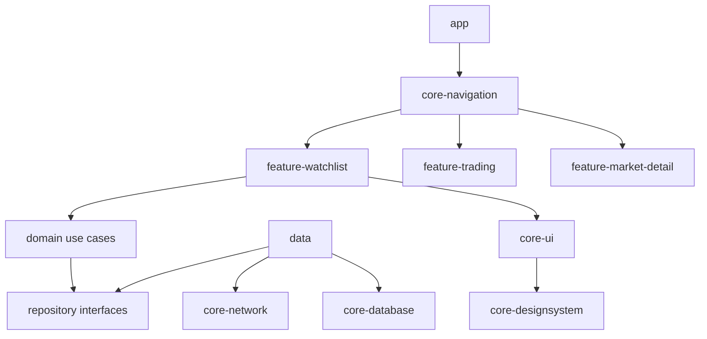
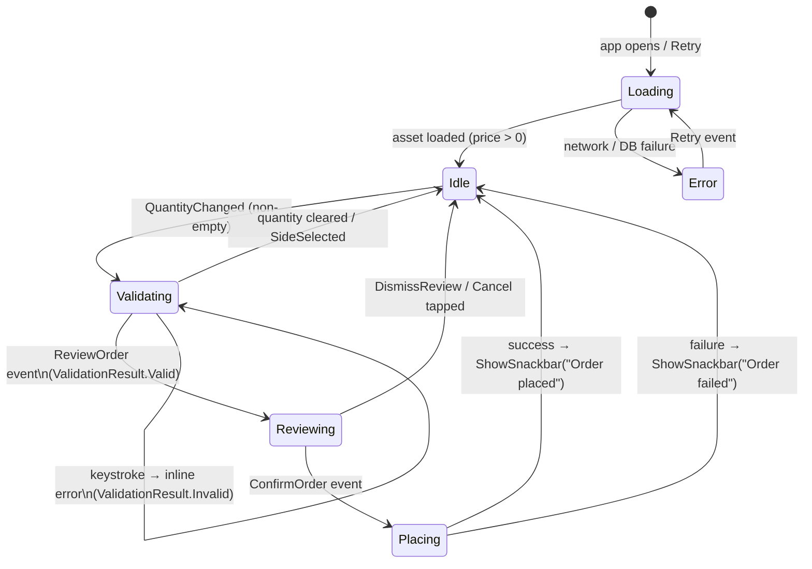

# Realtime Trading Android Portfolio App

[](https://github.com/kaunghtetsan1101/realtime-trading-android/actions/workflows/ci.yml)

## Summary

Native Android app for realtime market watching and simulated trading. Built as a senior-level portfolio project with Clean Architecture, MVI, and production-style patterns.

**Features:** watchlist with live prices, asset detail, search, BUY/SELL trading, portfolio with TP/SL, favourites tab, dark/light theme, offline cache, baseline profiles, and macrobenchmarks.

> Full architecture reference: [docs/architecture.md](docs/architecture.md)

## Tech Stack

| Category | Library |
|----------|---------|
| Language | Kotlin |
| UI | Jetpack Compose + Material3 |
| Navigation | Navigation 3 + bottom tab bar (Market / Watchlist / Portfolio) |
| Architecture | MVI + Clean Architecture |
| DI | Hilt |
| Async | Coroutines + Flow / StateFlow |
| Network | Retrofit + OkHttp + WebSocket |
| Persistence | Room + DataStore |
| Build | Gradle 9.5 + AGP 9.2 + Convention Plugins + Version Catalog |
| Testing | JUnit + MockK + Turbine + MockWebServer |
| Quality | detekt + Spotless + GitHub Actions |

## Module Structure

```
realtime-trading-android/
│
├── build-logic/            # Gradle convention plugins
├── app/                    # Entry point, MainActivity, Hilt bootstrap
├── core-navigation/        # Nav graph, routes, bottom nav shell
│
├── core-common/            # Result, dispatchers, ErrorMapper
├── core-ui/                # Shared Composables, theme wrapper
├── core-network/           # Retrofit, OkHttp, WebSocket
├── core-database/          # Room DB, DAOs, entities
├── core-datastore/         # Theme + logging preferences
├── core-designsystem/      # Color, typography, spacing, shape tokens
│
├── domain/                 # Models, repository interfaces, use cases
├── data/                   # Repository implementations, mappers
│
├── feature-watchlist/      # Watchlist screen
├── feature-market-detail/  # Asset detail screen
├── feature-search/         # Search screen
├── feature-trading/        # Trading + portfolio screens
├── feature-settings/       # Settings screen
│
├── baseline-profile/       # Baseline Profile generator
└── macrobenchmark/         # Startup + scroll benchmarks
```

### Dependency Rules

```
app            ──► core-navigation, core-ui, core-common, core-network,
                   core-database, domain, data
core-navigation──► feature-*
feature-*      ──► domain, core-ui, core-common
data           ──► domain, core-network, core-database, core-common
domain         ──► core-common   (no Android imports)
core-ui        ──► core-designsystem (api)
```

## Screenshots

> Add captures to [`docs/screenshots/`](docs/screenshots/) as `watchlist.png`, `detail.png`, `trading.png`, `portfolio.png`, `settings.png`.

| Watchlist | Market Detail | Trading | Portfolio | Settings |
|-----------|--------------|---------|-----------|---------|
| _(add screenshot)_ | _(add screenshot)_ | _(add screenshot)_ | _(add screenshot)_ | _(add screenshot)_ |

## Architecture

Clean Architecture with three layers per feature:

```
UI Layer (Compose / ViewModel)
    │  State + Events
    ▼
Domain Layer (Use Cases / Repository interfaces)
    │  Domain models
    ▼
Data Layer (Repository impl / DAOs / Network DTOs)
```

**MVI:** `Event → ViewModel → State (StateFlow)` and one-shot `Effect (Channel)`.



Live prices flow: Binance REST syncs assets into Room → WebSocket ticks update Room → UI observes DB.

## Design System

| Module | Contents |
|--------|----------|
| `core-designsystem` | `Color`, `Typography`, `Spacing`, `Shape` tokens |
| `core-ui` | `TradingAppTheme`, `AssetRow`, `PriceText`, `PercentageBadge`, `OfflineBanner`, `ErrorState`, `EmptyState` |

Theme follows system by default; override in **Settings → Appearance** (persisted via DataStore).

## TradingScreen State Machine



## Performance

### Baseline Profile

```bash
./gradlew :baseline-profile:generateBaselineProfile
```

Pre-compiles startup and watchlist scroll hot paths at install time.

### Macrobenchmarks

```bash
./gradlew :macrobenchmark:connectedBenchmarkAndroidTest
```

Requires a physical device (API 29+). The app uses a debug-signed `benchmark` build type for install.

**Results — OPPO CPH2689, Android 16 (2026-06-08, 5 iterations):**

| Benchmark | JIT (None) | Profile (Partial) | Improvement |
|-----------|------------|-------------------|-------------|
| Cold start TTID median (ms) | 315.7 | 289.1 | ~8% |
| Scroll frame timing | — | — | failed* |

\* Scroll benchmarks hit `StaleObjectException` from realtime UI updates invalidating the UiAutomator scroll node.

## Setup

**Prerequisites:** Android Studio Meerkat+, JDK 21, Android SDK 37.

```bash
git clone <repo-url>
cd realtime-trading-android
./gradlew spotlessApply   # first-time formatting fix
./gradlew assembleDebug
./gradlew test
```

## Troubleshooting

| Issue | Fix |
|-------|-----|
| Binance API blocked | Use VPN or unrestricted network; CI runners are typically blocked |
| JDK toolchain error | Set Gradle JDK to 21 in Android Studio or `JAVA_HOME` |
| Gradle sync fails | Run `./gradlew spotlessApply`, then invalidate caches |
| No connected tests | Ensure device/emulator is visible via `adb devices` |
| Macrobenchmark low battery | Charge device to 25%+ or suppress `LOW-BATTERY` in macrobenchmark config |

## CI

Four parallel jobs on every push/PR to `main` (`.github/workflows/ci.yml`):

| Job | Command |
|-----|---------|
| Build | `./gradlew assembleDebug` |
| Unit Tests | `./gradlew test` |
| Detekt | `./gradlew detekt` |
| Spotless | `./gradlew spotlessCheck` |

## Known Limitations

| Limitation | Detail |
|------------|--------|
| Simulated trading | Local Room state only; $10,000 virtual cash seed |
| WebSocket cap | Top 50 of 100 assets get live ticks; ranks 51–100 show last-synced price |
| No auth | No login or account system |
| No charting | Detail screen shows recent ticks only, not candlesticks |
| Scroll benchmark | UiAutomator stale-node failure under realtime price updates |

## Future Improvements

- Paper-trading sandbox API
- Candlestick charts with multiple timeframes
- Push notifications for price / TP/SL alerts
- Portfolio performance history chart
- Trailing stop-loss and partial position close
- Biometric lock for trading screen
- Home-screen price widget
- Compose UI test suite

## License

```
MIT License

Copyright (c) 2025 Kaung Htet San

Permission is hereby granted, free of charge, to any person obtaining a copy
of this software and associated documentation files (the "Software"), to deal
in the Software without restriction, including without limitation the rights
to use, copy, modify, merge, publish, distribute, sublicense, and/or sell
copies of the Software, and to permit persons to whom the Software is
furnished to do so, subject to the following conditions:

The above copyright notice and this permission notice shall be included in all
copies or substantial portions of the Software.

THE SOFTWARE IS PROVIDED "AS IS", WITHOUT WARRANTY OF ANY KIND, EXPRESS OR
IMPLIED, INCLUDING BUT NOT LIMITED TO THE WARRANTIES OF MERCHANTABILITY,
FITNESS FOR A PARTICULAR PURPOSE AND NONINFRINGEMENT.
```
