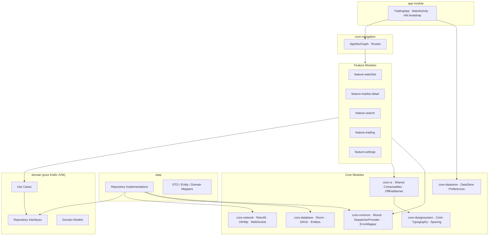
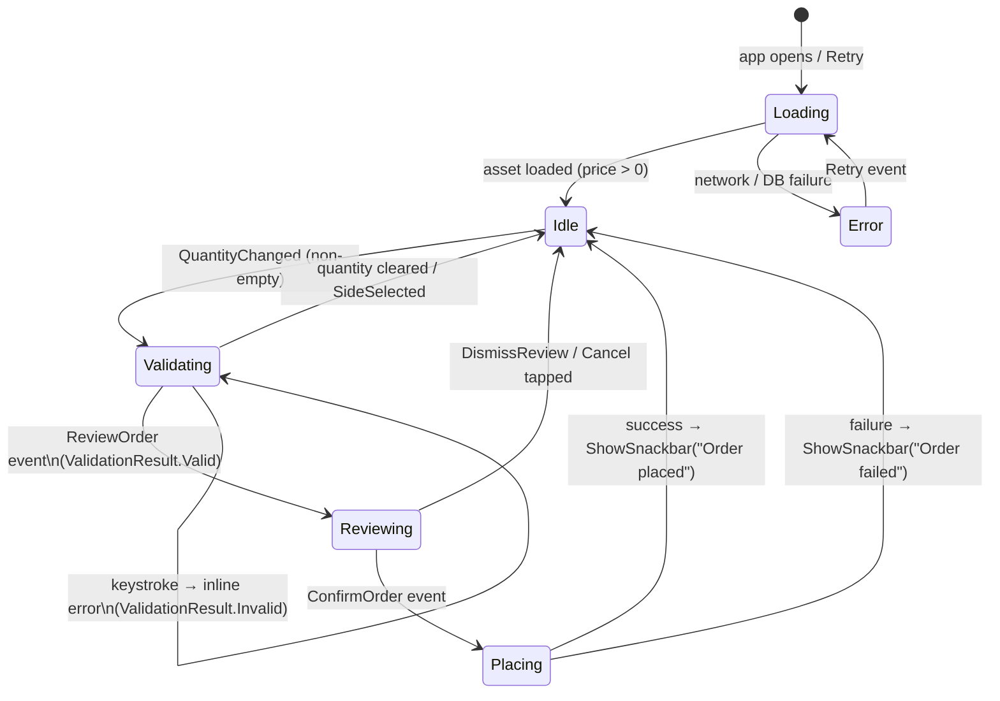

# Realtime Trading Android Portfolio App

[](https://github.com/kaunghtetsan1101/realtime-trading-android/actions/workflows/ci.yml)

A production-style Native Android app for realtime market watching and trading simulation.
Built with Kotlin, Jetpack Compose, MVI, Clean Architecture, and Hilt.

## Status

| Milestone | Status |
|-----------|--------|
| M1 ──► Project Scaffold | ✅ Done |
| M2 ──► Core Infrastructure | ✅ Done |
| M3 ──► Domain Layer | ✅ Done |
| M4 ──► Data Layer | ✅ Done |
| M5 ──► Watchlist Feature (MVP core) | ✅ Done |
| M6 ──► Asset Detail | ✅ Done |
| M7 ──► Design System + Dark Mode | ✅ Done |
| M8 ──► Search | ✅ Done |
| M9 ──► Trading Screen + Portfolio | ✅ Done |
| M10 ──► Settings + Polish | ✅ Done |

## Tech Stack

| Category | Library |
|----------|---------|
| Language | Kotlin |
| Preferences | DataStore Preferences |
| UI | Jetpack Compose + Material3 |
| Architecture | MVI + Clean Architecture |
| DI | Hilt |
| Async | Coroutines + Flow / StateFlow |
| Network | Retrofit + OkHttp + WebSocket |
| Persistence | Room |
| Logging | Timber |
| Static analysis | detekt |
| Formatting | Spotless + ktlint |
| Build | Gradle 9.4.1 + AGP 9.2.1 + Convention Plugins + Version Catalog |
| Testing | JUnit + MockK + Turbine + MockWebServer |
| Debug | LeakCanary |
| CI | GitHub Actions |

## Module Structure

```
realtime-trading-android/
│
├── build-logic/            # Gradle convention plugins — eliminates duplicated build config
│
├── app/                    # Entry point: TradingApp (@HiltAndroidApp), MainActivity, DI bootstrap
├── core-navigation/        # AppNavGraph, Routes, NavigationViewModel — wires all feature screens
│
├── core-common/            # Result<T>, DispatcherProvider, NetworkStatus, Flow extensions
├── core-ui/                # Shared Composables, Material3 theme, OfflineBanner
├── core-network/           # Retrofit, OkHttp, WebSocketManager, NetworkMonitor
├── core-database/          # Room DB, AssetDao, AssetEntity
│
├── domain/                 # Models, repository interfaces, use cases (pure Kotlin)
├── data/                   # Repository implementations, mappers, Hilt bindings
│
├── core-designsystem/      # Design tokens — Color, Typography, Spacing, Shape
│
├── feature-watchlist/      # Watchlist screen — MVI ViewModel, UI, contract, tests
├── feature-market-detail/  # Asset detail screen — live price ticker, 24h stats
├── feature-search/         # Search screen — in-memory filter/sort, debounced query, MVI
├── feature-trading/        # TradingScreen (BUY/SELL), PortfolioScreen (P&L, order history)
├── feature-settings/       # SettingsScreen — theme mode, verbose logging, app version
│
├── core-datastore/         # DataStore Preferences — ThemeMode + verbose logging persistence
│
├── baseline-profile/       # Generates Baseline Profile (startup + watchlist scroll)
└── macrobenchmark/         # Macrobenchmarks: cold startup and watchlist frame timing
```

### Dependency Rules

```
app            ──► core-navigation, core-ui, core-common, core-network,
                   core-database, domain, data   (Hilt component aggregation)
core-navigation──► feature-watchlist, feature-market-detail, feature-search, feature-trading, feature-settings
feature-*      ──► domain, core-ui, core-common
data           ──► domain, core-network, core-database, core-common
domain         ──► core-common   (no Android imports)
core-ui        ──► core-designsystem (api — exposes tokens to all consumers)
core-designsystem  (pure design tokens — Color, Typography, Spacing, Shape)
```

## Screenshots

> Screenshots are stored in [`docs/screenshots/`](docs/screenshots/). To add them: run the app on a device or emulator, capture each screen, save as `watchlist.png`, `detail.png`, `trading.png`, `portfolio.png`, `settings.png`, and update the table below.

| Watchlist | Market Detail | Trading | Portfolio | Settings |
|-----------|--------------|---------|-----------|---------|
| _(add screenshot)_ | _(add screenshot)_ | _(add screenshot)_ | _(add screenshot)_ | _(add screenshot)_ |

## Architecture

> Full reference: [docs/architecture.md](docs/architecture.md)

The app follows Clean Architecture with three layers per feature:

```
UI Layer (Compose / ViewModel)
    │  State + Events
    ▼
Domain Layer (Use Cases / Repository interfaces)
    │  Domain models
    ▼
Data Layer (Repository impl / DAOs / Network DTOs)
```

**MVI pattern inside each feature:**
```
Event ──► ViewModel ──► State (StateFlow)
                   └──► Effect (Channel — one-shot)
```

### Architecture Diagram



## Data Flow (Live Prices)

```
Binance REST  GET /api/v3/ticker/24hr?type=MINI
       │  all USDT pairs, sorted by volume, top 100
       ▼
AssetRepositoryImpl.syncAssets()
  ├── upserts 100 assets into Room
  └── builds WebSocket URL (top 50 streams)
       │
       ▼
Binance WebSocket  wss://stream.binance.com/stream?streams=...
       │  miniTicker frames ~1 s
       ▼
WebSocketManager.observePriceTicks()   [callbackFlow + retryWhen backoff]
       │
       ▼
AssetRepositoryImpl
  ├── writes updated price to Room (offline cache)
  └── MutableStateFlow<String?> + flatMapLatest — reconnects on URL change
       │
       ▼
GetWatchlistUseCase ──► observeAssets() ──► Room emits ──► UI re-renders

observePriceTicks(symbol) ──► MarketDetailViewModel.recentPrices ──► price ticker
```

## Design System

The design system is split across two modules:

**`core-designsystem`** — pure tokens with no composable logic:

| File | Contents |
|------|----------|
| `Color.kt` | Raw palette (`Green500`, `Red500`), semantic tokens (`PriceUp`, `PriceDown`), Material3 `DarkColorScheme` / `LightColorScheme` |
| `Typography.kt` | `TradingTypography` — 5 Material3 text styles (titleLarge → labelSmall) |
| `Spacing.kt` | `Spacing` object — named scale: `xxs=2`, `xs=4`, `sm=8`, `md=12`, `lg=16`, `xl=24`, `xxl=32`, `xxxl=48` dp |
| `Shape.kt` | `TradingShapes` — explicit corner radii for all 5 Material3 shape tiers |

**`core-ui`** — reusable Compose components:

| Component | Purpose |
|-----------|---------|
| `TradingAppTheme` | Root theme — wires color scheme, typography, and shapes into `MaterialTheme` |
| `PriceText` | Neutral-colour price display; pair with `PercentageBadge` for direction |
| `PercentageBadge` | Colour-coded `+2.34%` / `-1.12%` badge with trend icon; merges semantics for a11y |
| `AssetRow` | Shared list row — symbol, name, price, % change, favourite toggle; used by Watchlist and Search |
| `MarketCard` | Card-style tile for grid / carousel layouts (future use) |
| `SectionHeader` | Section title with optional trailing action label |
| `PrimaryActionButton` | Full-width 48 dp primary CTA button |
| `LoadingIndicator` | Centred `CircularProgressIndicator` |
| `ErrorState` | Error icon + message + optional Retry button |
| `EmptyState` | Customisable icon + title + subtitle for no-results states |
| `OfflineBanner` | Animated slide-in banner showing cache age when offline |

**Dark mode** follows system preference via `isSystemInDarkTheme()` with no runtime toggle required.
Every component has paired `@Preview` annotations for both light and dark to catch visual regressions in Android Studio.

**Accessibility highlights:**
- Icon-only buttons (`Favorite`, back, clear) carry explicit `contentDescription` values
- Secondary text uses `onSurfaceVariant` (Material3 semantic token) instead of raw `alpha(0.6f)` to guarantee contrast compliance
- `PercentageBadge` merges its icon + text into one semantics node so screen readers announce it as a single value
- `PrimaryActionButton` enforces 48 dp minimum touch target height

## Trading & Portfolio (M9)

### Screens

| Screen | Description |
|--------|-------------|
| `TradingScreen` | BUY/SELL toggle, quantity input, quick-fill buttons (25 / 50 / 75 / MAX), live price display, order summary card, confirmation `ModalBottomSheet` |
| `PortfolioScreen` | Total portfolio value card, cash balance, open positions with live unrealised P&L, order history list, per-position "Trade" shortcut |

### Domain models added

| Model | Purpose |
|-------|---------|
| `Order` | Placed order record (symbol, side, quantity, price, timestamp) |
| `Position` | Open position (symbol, quantity, average cost) |
| `Portfolio` | Snapshot — cash + positions + total value |
| `ValidationResult` | Sealed result of `ValidateOrderUseCase` (Valid / error variants) |

### Use cases

| Use Case | Behaviour |
|----------|-----------|
| `ValidateOrderUseCase` | Pure synchronous validation — checks quantity > 0, sufficient balance (BUY) or position size (SELL) |
| `PlaceOrderUseCase` | Executes order atomically via `TradeRepository` |
| `GetPortfolioUseCase` | Combines Room positions with live price flow to compute unrealised P&L reactively |
| `GetOrderHistoryUseCase` | Streams all placed orders from Room, newest first |

### Database migrations

- `TradingDatabase` version 2 → 3 adds `orders`, `positions`, and `wallet` tables.
- `WalletEntity` is a single-row table seeded with $10 000 on first access.

### TradingScreen state machine



State fields: `isLoading`, `currentPrice`, `error`, `validationError`, `isReviewVisible`, `isPlacingOrder`

### Offline state

`TradingScreen` and `PortfolioScreen` both subscribe to `ObserveNetworkStatusUseCase` and
surface an `OfflineBanner` in the `topBar` when connectivity is lost. Room holds the last-known
prices and balances, so screens remain usable offline with a clear staleness indicator.

### Test coverage (44 cases across 6 test files)

| Test class | Module | Cases | What is tested |
|---|---|---|---|
| `ValidateOrderUseCaseTest` | `feature-trading` | ~8 | All BUY/SELL validation error paths |
| `PlaceOrderUseCaseTest` | `feature-trading` | 8 | Order construction, SELL side, status, totalValue, exception wrapping |
| `TradingViewModelTest` | `feature-trading` | 16 | State transitions, validation, WS price tick, QuickFill, offline flag |
| `PortfolioViewModelTest` | `feature-trading` | 8 | Loading/error/portfolio states, order history, Retry, effects, offline flag |
| `TradeRepositoryImplTest` | `data` | 11 | Wallet debit/credit, weighted avg price, position upsert/delete, atomic flow |
| `GetPortfolioUseCaseTest` | `domain` | 7 | P&L math, reactive price update, zero-cost basis, missing-price fallback |

## Settings & Polish (M10)

### Settings screen

Navigated from the gear icon in the Watchlist top bar.

| Section | Contents |
|---------|----------|
| Appearance | Theme mode selector — System / Light / Dark (`SingleChoiceSegmentedButtonRow`) |
| Developer Options | Verbose Logging toggle — controls Timber planting at next app start |
| About | App version name, app description |

Theme preference is persisted in `core-datastore` (Preferences DataStore). `MainActivity` reads the stored `ThemeMode` as a `collectAsStateWithLifecycle` Flow and passes the resolved `Boolean` to `TradingAppTheme` — no flash workaround needed for a portfolio app.

### Error handling

`ErrorMapper` (in `core-common`) provides user-friendly messages for all network exceptions:

| Exception | Message |
|-----------|---------|
| `UnknownHostException` | "No internet connection. Showing cached data." |
| `SocketTimeoutException` | "Request timed out. Please retry." |
| `IOException` | "Connection error. Please retry." |
| Other | `localizedMessage` or "An unexpected error occurred." |

All ViewModels (`Watchlist`, `MarketDetail`, `Search`, `Trading`, `Portfolio`) route errors through `ErrorMapper`. Raw exception messages no longer reach the UI.

### Retry completeness

| Screen | Error retry |
|--------|------------|
| Watchlist | ✅ Retry button resyncs assets |
| MarketDetail | ✅ Retry button reloads asset |
| Search | ✅ Retry button re-triggers combine |
| Trading | ✅ Added — was missing (`TradingEvent.Retry`) |
| Portfolio | ✅ Added — `PortfolioEvent.Retry` + `.catch {}` on Room flows |

### New modules

| Module | Type | Purpose |
|--------|------|---------|
| `core-datastore` | `android.library` + Hilt | Preferences DataStore — `ThemeMode`, verbose logging |
| `feature-settings` | `android.feature` | `SettingsScreen` + `SettingsViewModel` |

### Test coverage added (M10)

- `ErrorMapperTest` (6 cases) — mapping for all exception types including edge cases
- `SettingsViewModelTest` (7 cases) — theme/logging state, reactive updates, NavigateBack effect

## Performance

### Baseline Profiles
A Baseline Profile pre-compiles hot code paths (startup and watchlist scroll) at install
time via ART's profile-guided optimisation. This reduces cold-start latency and first-scroll
jank without any runtime overhead.

```bash
# Requires a connected device or emulator (API 28+)
./gradlew :baseline-profile:generateBaselineProfile
```

### Macrobenchmarks
Two macrobenchmarks compare `CompilationMode.None()` (JIT only) vs `CompilationMode.Partial()`
(with Baseline Profile) across cold startup and watchlist scrolling:

```bash
# Requires a connected device (API 29+, non-emulator recommended for accurate results)
./gradlew :macrobenchmark:connectedBenchmarkAndroidTest
```

| Benchmark | CompilationMode.None (JIT) | CompilationMode.Partial (Profile) | Improvement |
|-----------|---------------------------|-----------------------------------|-------------|
| Cold startup (ms) | — | — | — |
| Scroll P50 frame (ms) | — | — | — |
| Scroll P90 frame (ms) | — | — | — |
| Scroll P99 frame (ms) | — | — | — |

> Run `./gradlew :macrobenchmark:connectedBenchmarkAndroidTest` on a physical device (API 29+, no emulator) and replace `—` with the measured values. Emulators produce unreliable frame timing due to software rendering.

## Setup

### Prerequisites
- Android Studio Meerkat (2025.1) or newer
- JDK 21
- Android SDK 36

### Clone and open
```bash
git clone <repo-url>
cd realtime-trading-android
# Open in Android Studio — it will sync Gradle automatically
```

### First-time formatting fix
After cloning, run once to format all existing files so CI passes:
```bash
./gradlew spotlessApply
```

### Build from CLI
```bash
./gradlew assembleDebug
```

### Run tests
```bash
./gradlew test                             # All unit tests
./gradlew :feature-watchlist:test          # Watchlist tests only
./gradlew :feature-market-detail:test      # Market detail tests only
./gradlew :feature-search:test             # Search tests only
./gradlew :core-network:test               # Network + MockWebServer tests
./gradlew connectedAndroidTest             # Instrumented tests (requires emulator)
```

## Troubleshooting

### Binance WebSocket or REST is unreachable

Binance blocks API access from some regions and CI environments. If the watchlist shows a loading
spinner indefinitely or the WebSocket never connects:

- Use a VPN or a device with unrestricted internet access.
- CI pipelines (GitHub Actions hosted runners) are typically blocked — this is expected. The four
  CI jobs (build, test, detekt, spotless) are all JVM-only and do not require network access.
- The instrumented smoke test (`WatchlistNavigationTest`) is excluded from CI for this reason.
  Run it locally with `./gradlew :app:connectedDebugAndroidTest`.

### JDK version mismatch

The project requires **JDK 21**. If Gradle sync fails with a toolchain error:

```
No matching toolchain could be found for requested specification: ...
```

Install JDK 21 via Android Studio (**Settings → Build → Build Tools → Gradle → Gradle JDK**) and
re-sync. Alternatively set `JAVA_HOME` to a JDK 21 installation before running Gradle from the
terminal.

### Gradle sync fails after clone

Run the formatting fix once before opening in Android Studio:

```bash
./gradlew spotlessApply
```

If sync still fails, try invalidating caches: **File → Invalidate Caches → Invalidate and Restart**.

### `connectedAndroidTest` finds no tests

Ensure an emulator or device is connected (`adb devices`) before running. The instrumented test
requires API 26+ (minSdk).

## Code Quality

### Static analysis — detekt
```bash
./gradlew detekt
```
Config: `config/detekt/detekt.yml`. Rules are tuned for Compose and MVI patterns —
`LongMethod`, `LongParameterList`, and `FunctionNaming` are relaxed for `@Composable` functions.
`MatchingDeclarationName` is disabled because Compose files contain multiple top-level declarations.

### Formatting — Spotless + ktlint
```bash
./gradlew spotlessCheck    # CI — fails on violations
./gradlew spotlessApply    # Auto-fix locally
```
Line length: 120 chars. IDE and ktlint both read `.editorconfig` from the project root.

## Logging

[Timber](https://github.com/JakeWharton/timber) is the logging library for all modules that
produce meaningful runtime events (`app`, `core-network`, `data`, feature modules).

- `Timber.DebugTree` is planted in `TradingApp.onCreate()` for debug builds only.
- Release builds have zero logging overhead — no tree is planted and calls are no-ops.
- `WebSocketManager` logs connect, tick (VERBOSE), failure (ERROR), and close (DEBUG) events.

## Debug Tools

**LeakCanary** is a `debugImplementation` dependency in the `app` module. It auto-installs
via a `ContentProvider` and surfaces memory leaks in the debug notification shade. No code
changes are required and it is automatically excluded from release builds.

## Testing

| Layer | Tool | Location |
|-------|------|---------|
| ViewModel state & effects | JUnit + MockK + Turbine | feature-watchlist, feature-market-detail, feature-search, feature-trading |
| Use case logic | JUnit + MockK | feature-trading, domain |
| Repository logic | JUnit + MockK + Turbine | data |
| WebSocket flow | Turbine + MockK | core-network |
| HTTP API parsing | JUnit + MockWebServer | core-network (`MarketApiTest`) |
| Mapper correctness | JUnit | data |

**MockWebServer** runs a real in-process HTTP server during tests. `MarketApiTest` uses it to
verify Retrofit query parameter encoding and Gson deserialisation without any network access.

**Turbine** is used across all Flow-based tests to assert emissions, errors, and completion
without manual coroutine coordination.

## CI

Four jobs run in parallel on every push and pull request to `main`:

| Job | Command | Purpose |
|-----|---------|---------|
| Build | `./gradlew assembleDebug` | Verify the project compiles |
| Unit Tests | `./gradlew test` | Run all JVM unit tests; upload reports as artifacts |
| Detekt | `./gradlew detekt` | Static analysis |
| Spotless | `./gradlew spotlessCheck` | Formatting check |

Workflow: `.github/workflows/ci.yml`.
Gradle build cache is managed by `gradle/actions/setup-gradle@v4` — incremental runs are
significantly faster than cold builds.

## Key Design Decisions

| Decision | Choice | Rationale |
|----------|--------|-----------|
| Domain module plugin | `kotlin.jvm` | Pure Kotlin — no Android deps, fast JVM tests |
| Offline cache strategy | Room as single source of truth | WebSocket ticks write to DB; UI observes DB only |
| Effect delivery | `Channel<Effect>` | One-shot, not replayed on recomposition |
| WS lifecycle | `callbackFlow` + `awaitClose` | WS closes automatically when collector cancels |
| Dispatcher injection | `DispatcherProvider` interface | Enables deterministic coroutine tests |
| Dynamic symbol discovery | Binance mini-ticker REST | Fetch all USDT pairs sorted by volume; no hardcoded symbol list |
| WS stream limit | Top 50 of 100 tracked assets | Binance combined-stream cap; ranks 51-100 show last-synced price |
| Dynamic WS reconnect | `MutableStateFlow<String?> + flatMapLatest` | URL changes after sync automatically cancel old WS and open new one |
| Navigation extraction | `core-navigation` module | Feature modules have zero knowledge of routes; `app` only depends on `core-navigation` |
| Convention plugins | `build-logic` composite build | ~150 lines of duplicated Gradle config replaced with 6 composable plugins; same approach as Now in Android |
| JVM toolchain | 21 (via `gradle-daemon-jvm.properties`) | Replaces the foojay settings plugin; toolchain URLs resolved once at daemon start rather than on every project sync |
| Kotlin 2.4 / Hilt metadata fix | `resolutionStrategy.force("kotlin-metadata-jvm:2.4.0")` | Hilt 2.59 bundles `kotlin-metadata-jvm` capped at 2.3.0; forcing 2.4.0 in root `allprojects` resolves the version conflict without waiting for a Hilt release |
| detekt at root | Single task scans all modules | Simpler than per-module config; one CI command covers all modules |
| No detekt-formatting | Spotless handles formatting | Avoids duplicate ktlint execution and conflicting rule sets |
| Timber debug-only | `if (BuildConfig.DEBUG)` guard | Release APK has zero logging cost; no stripping step needed |
| LeakCanary debug-only | `debugImplementation` | Auto-excluded from release; no ProGuard rules required |
| Search filter location | ViewModel (not use case) | `AssetFilter`/`SortOrder` are UI concerns; no domain pollution |
| Search debounce target | Query only | Filter/sort are discrete taps — debounce adds latency with no benefit |
| Design token split | `core-designsystem` + `core-ui` | Tokens (Color, Spacing, Shape) in a Compose-only module; components in `core-ui` which re-exports tokens via `api` dep |
| `AssetRow` extraction | `core-ui` shared component | Identical row existed in Watchlist and Search; single source of truth eliminates drift |
| Secondary text colour | `onSurfaceVariant` token | Replaces raw `alpha(0.6f)` — guaranteed contrast in both themes without manual tuning |
| Atomic order placement | `room.withTransaction` | Wallet debit, position upsert/delete, and order insert execute atomically — partial state is impossible |
| `runInTransaction` testability | `open internal` method on `TradeRepositoryImpl` | Room 2.8.x `withTransaction` is an Android-specific extension; unit tests override this single method to call the block directly, keeping tests fast and hermetic without `mockkStatic` |
| Seed wallet | Single-row `WalletEntity` ($10 000) | Pre-seeded on first access; avoids a separate onboarding flow for a portfolio demo |
| `ValidateOrderUseCase` is pure | No I/O, no coroutine | Enables synchronous real-time validation on every keystroke without suspending the ViewModel |
| `TradingViewModel` assisted inject | `@AssistedInject` + `symbol` param | Passes the asset symbol at runtime without a global state holder or saved-state workaround |
| Portfolio live P&L | Derived in `GetPortfolioUseCase` | Combines Room positions + live price flow to compute unrealised P&L reactively; no extra DB column |
| Theme persistence | Preferences DataStore in `core-datastore` | Lightweight KV store; no Proto schema required for two boolean/enum preferences |
| Theme wiring in `MainActivity` | `collectAsStateWithLifecycle` + `isSystemInDarkTheme()` | Theme resolves inside `setContent` — no Activity recreation required when user picks System |
| `ErrorMapper` in `core-common` | Maps `IOException` hierarchy | Pure JVM — no Retrofit dependency in core-common; HttpException handling stays in data layer |
| `AppInfo` provided by `app` module | `@Provides @Singleton` in `AppInfoModule` | Only the `app` module knows `BuildConfig.VERSION_NAME`; injected into `SettingsViewModel` via Hilt |
| PortfolioViewModel retry | `Job` per flow + `.catch {}` | Room flows don't normally throw, but `.catch` is the safety net; Job tracking prevents duplicate observers on retry |

## Known Limitations

| Limitation | Detail |
|---|---|
| Simulated data only | All prices come from the Binance public WebSocket feed. No real orders are placed; the portfolio is entirely local state seeded with $10,000 virtual cash. |
| WebSocket stream cap | Binance combined-stream endpoint caps at 1,024 streams. The app tracks the top 100 USDT assets and subscribes to the top 50 by volume; assets ranked 51–100 show last-synced price without a live tick. |
| No authentication | There is no user login or account system. This is intentional for a portfolio demo. |
| No real-money trading | Order placement writes to Room only. No broker API integration exists. |
| Theme flash on first launch | The app renders with the system default theme for ~1 frame before DataStore resolves the stored preference. Acceptable for a portfolio demo; solvable with a SplashScreen API pre-commit. |
| No price alerts | Push notifications for price thresholds are not implemented. |
| No charting | Price history is limited to the last 50 ticks shown as a simple line in the Detail screen. Full candlestick charting is a Phase 2 enhancement. |
| Verbose logging default | Fresh installs start with verbose logging enabled. Users can disable it in Settings → Developer Options. |
| Destructive Room migration | `TradingDatabase` uses `fallbackToDestructiveMigration()`. Any schema change wipes local data on the next app launch. Acceptable for a portfolio demo; a production app would supply explicit migration objects. |

## Interview Notes

Key design decisions, architecture tradeoffs, and common interview questions with answers are documented in [`references/interview_talking_points.md`](references/interview_talking_points.md).

## Future Improvements

- Replace simulated orders with a paper-trading sandbox API
- Candlestick chart with multiple time-frame support
- Push notifications for price thresholds
- Portfolio performance over time (historical P&L chart)
- Biometric lock for the trading screen
- Widget for home-screen price tiles
- Full Compose UI test suite (instrumented)

## License

```
MIT License

Copyright (c) 2025 Kaung Htet San

Permission is hereby granted, free of charge, to any person obtaining a copy
of this software and associated documentation files (the "Software"), to deal
in the Software without restriction, including without limitation the rights
to use, copy, modify, merge, publish, distribute, sublicense, and/or sell
copies of the Software, and to permit persons to whom the Software is
furnished to do so, subject to the following conditions:

The above copyright notice and this permission notice shall be included in all
copies or substantial portions of the Software.

THE SOFTWARE IS PROVIDED "AS IS", WITHOUT WARRANTY OF ANY KIND, EXPRESS OR
IMPLIED, INCLUDING BUT NOT LIMITED TO THE WARRANTIES OF MERCHANTABILITY,
FITNESS FOR A PARTICULAR PURPOSE AND NONINFRINGEMENT.
```
